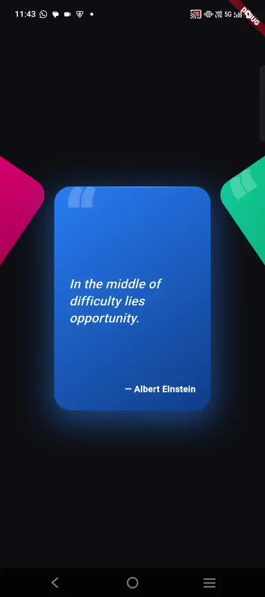
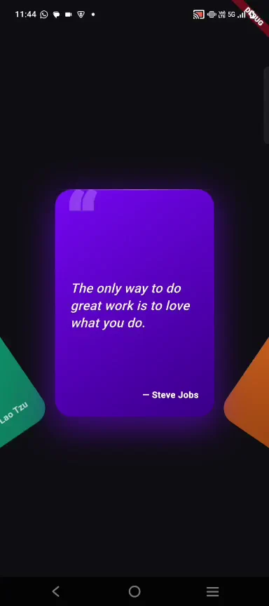

# circular_animated_carousel

A circular, gesture-driven carousel for **any widget** — cards, images, tickets, custom painters. Side items lean inward like a garland (or outward like a bowl), the focused item stays visually emphasised through a `focusWeight` you can wire into halos, gradients, scale, or opacity, and the entrance animation streams items in from the right.

[](https://pub.dev/packages/circular_animated_carousel)
[](LICENSE)

<table>
  <tr>
    <th align="center">ArcDirection.up (default)</th>
    <th align="center">ArcDirection.down</th>
  </tr>
  <tr>
    <td align="center">
      
    </td>
    <td align="center">
      
    </td>
  </tr>
  <tr>
    <td align="center">Side items rise <strong>above</strong>, tilt inward (smile).</td>
    <td align="center">Side items drop <strong>below</strong>, tilt outward (bowl).</td>
  </tr>
</table>

## Install

```bash
flutter pub add circular_animated_carousel
```

```dart
import 'package:circular_animated_carousel/circular_animated_carousel.dart';
```

## Features

- **Content-agnostic** — `itemBuilder` returns any `Widget`. The package never assumes you're rendering cards.
- **Garland tilt + side-lift arc** — neighbouring items tilt and rise (or drop) along a cosine arc; choose `ArcDirection.up` (smile, default) or `ArcDirection.down` (bowl).
- **Two entrance modes** — quick *displacement slide* (default) or full-duration *position stream* (set `entranceStartOffset: -9.0`).
- **Responsive by default** — pixel dimensions are scaled to a configurable `referenceWidth` (default `360`), so a layout tuned on a Figma artboard looks the same on every phone.
- **Circular wrap** (`circular: true`) — last item loops back to first; `info.index` is auto-wrapped so builders can index data arrays directly.
- **Programmatic control** — `CircularAnimatedCarouselController` for `next` / `previous` / `animateTo` / `jumpTo`, with current-index/position getters.
- **Autoplay** with `pauseOnInteraction` so the timer never fights the user's finger.
- **Snap mode toggle** (`enableSnap: false` → free-scroll gallery; default snaps to nearest item).
- **`onTap` with tap-to-focus** — tapping a side item auto-animates focus to it.
- **One-shot nudge bob** to hint at vertical drag interactions after the entrance settles.
- **`entranceDelay`** so the slide doesn't fire while a host bottom-sheet / modal is still opening.
- **Distance-sorted Z order** — focused item always paints on top.
- **`RepaintBoundary` per item** — every card is rasterised once and cached as a GPU layer.
- **Stable keys** so the distance sort never reorders Element identities.

## Quickstart

```dart
CircularAnimatedCarousel(
  itemCount: photos.length,
  circular: true,
  itemBuilder: (context, info) => Image.network(photos[info.index]),
)
```

That's it — sensible defaults for everything else. Drag, flick, snap-to-index, garland tilt, responsive sizing, all on by default.

## Usage

### Cards

```dart
CircularAnimatedCarousel(
  itemCount: coupons.length,
  itemWidth: 200,
  itemHeight: 280,
  itemSpacing: 255,
  circular: true,
  entranceStartOffset: -9.0,            // cards visibly stream from the right
  entranceDelay: Duration(milliseconds: 180),
  entranceDuration: Duration(milliseconds: 2400),
  onIndexChanged: (i) => print('focused $i'),
  itemBuilder: (context, info) => MyCouponCard(
    coupon: coupons[info.index],
    showHalo: info.focusWeight > 0.5,
  ),
)
```

### Images

```dart
CircularAnimatedCarousel(
  itemCount: photos.length,
  itemWidth: 240,
  itemHeight: 320,
  itemBuilder: (context, info) => ClipRRect(
    borderRadius: BorderRadius.circular(16),
    child: Image.network(
      photos[info.index],
      fit: BoxFit.cover,
      // Dim non-focused photos so the centred one pops.
      color: Colors.black.withValues(alpha: 0.6 * (1 - info.focusWeight)),
      colorBlendMode: BlendMode.darken,
    ),
  ),
)
```

### Any custom widget

```dart
CircularAnimatedCarousel(
  itemCount: 5,
  itemWidth: 160,
  itemHeight: 160,
  itemBuilder: (context, info) => Transform.scale(
    // Side items shrink slightly; focused one is full size.
    scale: 0.85 + 0.15 * info.focusWeight,
    child: CustomPaint(painter: SpinningRingPainter(index: info.index)),
  ),
)
```

## `CarouselItemInfo`

Every `itemBuilder` call receives this struct. Use it to vary visuals based on how close the item is to focus.

| Field | Type | Meaning |
|-------|------|---------|
| `index` | `int` | This item's index. In circular mode, pre-wrapped to `[0, itemCount)`. |
| `offset` | `double` | Signed distance from focus. `0.0` = centered; negative = left; positive = right. |
| `distance` | `double` | `offset.abs()` — when you only care about how far. |
| `focusWeight` | `double` | `1.0` when exactly focused, falls smoothly to `0.0` at the neighbouring slot. Wire into halos, opacity, scale, glow alpha. |

## Programmatic control

```dart
final controller = CircularAnimatedCarouselController();

CircularAnimatedCarousel(
  controller: controller,
  itemCount: 5,
  itemBuilder: (c, info) => MyCard(),
);

// Drive it from buttons / tabs / deep links:
controller.next();
controller.previous();
controller.animateTo(3);
controller.jumpTo(0);
print(controller.currentIndex);     // wrapped in circular mode
print(controller.currentPosition);  // fractional, live
```

**Note**: the verbose name avoids a collision with Flutter `material`'s own `CarouselController` (added in 3.16 for `CarouselView`). Remember to `dispose()` it on State teardown.

## Arc direction

See the demos at the top of this README.

```dart
arcDirection: ArcDirection.up    // default (smile)
arcDirection: ArcDirection.down  // bowl
```

Both lift and tilt flip together so the geometry stays consistent — the package never produces a half-mirrored arc.

## Responsive sizing

```dart
referenceWidth: 360.0  // default — values are designed for a 360 px viewport
```

The package scales `itemWidth`, `itemHeight`, `itemSpacing`, `sideLift`, and `nudgeAmplitude` by `actualViewport / referenceWidth`. A layout tuned at 360 px renders ~14 % larger on a 411 px Pixel and ~11 % smaller on a 320 px Android Go device — proportions stay identical.

Pass `null` to opt out and use raw logical pixels.

## Spacing

Two ways to control the gap between adjacent items — pick one:

```dart
viewportFraction: 0.65    // gap = viewport * 0.65 (proportional, default)

// OR

itemSpacing: 255          // absolute pixels (scaled by referenceWidth)
                          // wins over viewportFraction when set
```

## Autoplay + free-scroll + tap

```dart
CircularAnimatedCarousel(
  autoplay: true,
  autoplayInterval: Duration(seconds: 3),
  pauseOnInteraction: true,        // resumes when the user lets go
  enableSnap: false,               // free-scroll gallery (no snap to nearest)
  onTap: (i) => print('tapped $i'), // non-focused taps also animate focus to that item
  itemBuilder: ...,
)
```

## Continuous interpolation across focus

`onPositionChanged` fires on every drag tick, snap tick, and position-stream entrance tick — use it when you need an effect that blends *between* items mid-drag (e.g. a rim glow that interpolates between two adjacent palettes).

```dart
onPositionChanged: (pos) {
  final lower = palette[pos.floor() % palette.length];
  final upper = palette[pos.ceil() % palette.length];
  glow.value = Color.lerp(lower, upper, pos - pos.floor())!;
},
```

For coarser "the user landed on index 3" reactions, use `onIndexChanged` instead — it only fires on settled snaps.

## Example

A runnable demo lives in [`example/`](example/) — five gradient quote cards on a dark canvas, position-stream entrance, circular wrap. Run it:

```bash
cd example && flutter run
```

## Roadmap

- `axis: Axis` for vertical carousels.
- Configurable spring physics on snap.
- Vertical drag callbacks for "drag to claim" patterns.
- Accessibility: semantics labels, screen reader announcements, keyboard navigation.
- Golden tests.

## License

MIT — see [LICENSE](LICENSE).
